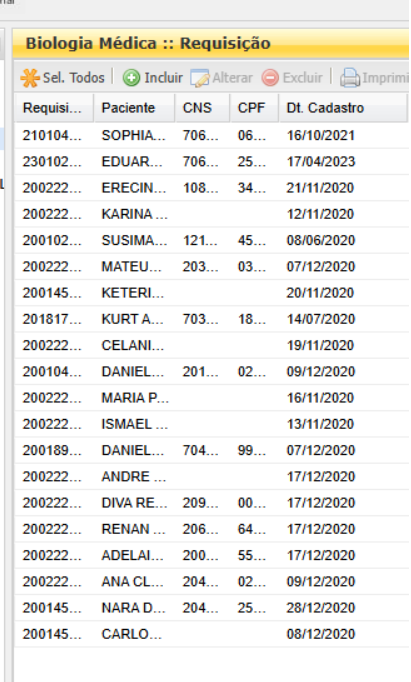
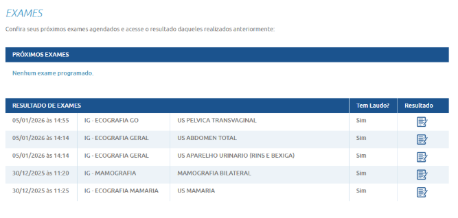

PROCESSOS LABORATORIAIS INTERNOS

\>> A amostra é recebida no laboratório e é feito o cadastro e verificação para seguimento. O cadastro é feito pelo profissional do laboratório, técnico ou analista.

**PÁGINA DE CADASTRO DE AMOSTRAS**

Campos:

\- Data da solicitação

\- Paciente nome

\- NOME SOCIAL

\- DATA NASCIMENTO

\- IDADE

\- SEXO

CPF

NACIONALIDADE

RAÇA/COR

NOME DA MÃE

ENDEREÇO (COMPLETO)

INFORMAÇÕES CLÍNICAS (campo aberto)

Hipótese de Diagnóstico

CID

Exames solicitados

Material clínico coletado

Data da coleta

Amostra única (SIM/NÃO)

Observações sobre a amostra (campo aberto)

Exames solicitados

Metodologia de análise (RT-PCR em tempo real/sequenciamento)

Amostra adequada para análise (SIM/NÃO)

Observações

**Após o cadastro é gerado um código e um QRcode para a amostra recebida.**

\>> As amostras cadastradas são listadas podendo ser filtradas sobre data de cadastro/recebimento ou pelo diagnóstico solicitado ou pela metodologia de análise (ex. RT-PCR em tempo real/sequenciamento). O seguimento é feito pelo profissional do laboratório, técnico ou analista. Nessa página eu posso selecionar as amostras cadastradas e em espera e direcioná-las para processamento.

**PÁGINA DE TRIAGEM DA AMOSTRA - Exemplo de página com todas as entradas esperando processamento**

\>>> Nessa página eu direciono a amostra para a etapa de processamento que ela está. As etapas podem ser:

- **Amostra em preparação**
- **Amostra em extração**
- **Amostra em PCR**
- **Amostra em qPCR**
- **Amostra na preparação de biblioteca**
- **Amostra em amplificação**
- **Amostra em sequenciamento**
- **Amostra em seguimento para análise e resultado**

Nessa página pode ter um novo campo de observação. Onde poderá ser colocado novas informações sobre algo que foi observado nas etapas do processamento.

**PÁGINA DE LAUDAMENTO**

\>>> Está página precisa ser construída em uma etapa posterior da empresa. Nela será selecionado a amostra que carregará os dados do paciente, o diagnóstico solicitado e será inserido os textos referentes que devem compor o laudo.

**PÁGINA DE RELATÓRIOS**

\>>>Construção de relatórios sobre total de amostras em um período de pesquisa, filtro por paciente por diagnóstico .

**PÁGINA DE CONSULTA PACIENTE/MÉDICO**

\>> Página online no qual o paciente entrará com o número do exame e senha. Página simples com a identificação do paciente, exame executado acesso e que dá acesso ao laudo para visualizar online ou para baixar.

Exemplo de página:

Perguntas feitas por mim:

1\. Quem são as pessoas que vão usar o sistema? (Ex: O vendedor, a recepcionista, o gerente financeiro, o cliente final...)

R: Profissional do laboratório, técnico ou analista

2\. Qual é a principal característica ou dificuldade dessas pessoas? (Ex: O vendedor fica muito na rua e usa só o celular; A recepcionista atende telefone ao mesmo tempo e precisa de telas rápidas; O gerente não entende muito de computador...)

R: Sem dificuldades. Os técnicos e analistas já estão habituados a usar esse tipo de sistema.

3\. O que cada um deles precisa conseguir fazer no sistema para ter sucesso no trabalho? (Tente pensar no formato: "O \[Fulano\] precisa \[Fazer tal coisa\] para \[Resolver tal problema\]")

R: Nesse momento seria interessante ter dois perfis, um administrador que tenha autorização para fazer todas as alterações. Um perfil com restrição sem autorização para exclusões de forma geral.