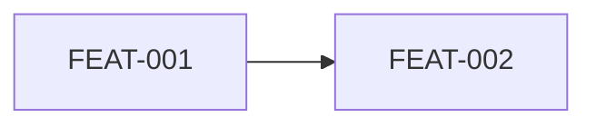
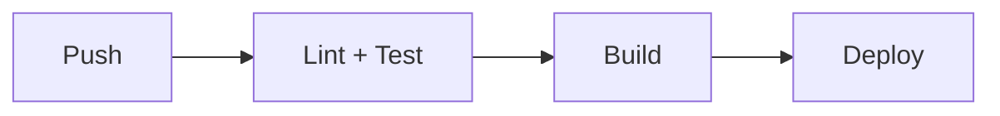

# IDEA-v3 — Templates de Artefatos

> **Quando usar:** FASE 4 para gerar os artefatos finais.
> **Carregue com:** `@IDEA-v3-TEMPLATES.MD`

---

## Estrutura `.cursor/rules/` (moderna)

```
.cursor/rules/
├── project-context.md      # alwaysApply: true
├── security.md             # alwaysApply: true
├── api-conventions.mdc     # globs: ["src/api/**"]
├── database.mdc            # globs: ["src/db/**"]
├── testing.mdc             # globs: ["**/*.test.*"]
└── frontend.mdc            # globs: ["src/components/**"]
```

### Formato de arquivo de regra

```markdown
---
description: Breve descrição da regra
globs: ["src/api/**"]  # OU alwaysApply: true
---

# Título da Regra

## Contexto
[Quando esta regra se aplica]

## Regras
- DEVE ...
- NÃO DEVE ...

## Exemplos
[Código quando relevante]
```

### Conteúdo mínimo por arquivo

| Arquivo | Conteúdo obrigatório |
|---------|---------------------|
| `project-context.md` | Contexto (2-3 linhas), Perfil, Stack/versões, Estrutura de diretórios |
| `security.md` | Regras de segurança, Classificação de dados, Ações proibidas, Checkpoints |
| `api-conventions.mdc` | Padrão de rotas, Formato request/response, Padrão de erros, Validação |
| `database.mdc` | Naming, Migrations, Constraints, Soft delete |
| `testing.mdc` | Framework, Cobertura mínima, Mocks, Estrutura |

---

## Template: `PRD.md`

```markdown
# PRD — [Nome do Projeto]

> **Resumo executivo (max 150 tokens):** [Resumo para referência rápida]

## 1. Visão geral
[1 parágrafo]

## 2. Classificação do projeto
- **Perfil:** PESSOAL | INTERNO | PRODUCAO (informado pelo solicitante)

## 3. Objetivos e não-objetivos
### Objetivos (MVP)
- ...

### Não-objetivos (fora do escopo)
- ...

## 4. Personas/papéis
| Persona | Descrição | Permissões |
|---------|-----------|------------|

## 5. User stories
### FEAT-001: [Título]
**Como** [persona], **quero** [ação], **para** [benefício].

#### Critérios de aceite (Gherkin)
```gherkin
# Happy path
Given [contexto]
When [ação]
Then [resultado esperado]

# Unhappy path
Given [contexto]
When [ação inválida]
Then [erro esperado com code]
```

#### Regras de negócio
- RULE-001: [descrição]

#### Testes associados
- TEST-001: [cenário]

## 6. Grafo de dependências


## 7. Regras de negócio consolidadas
| ID | Regra | Features | Erro se violada |
|----|-------|----------|-----------------|

## 8. Mapa de erros
| Code | Severity | Quando ocorre | Status | i18nKey |
|------|----------|---------------|--------|---------|

## 9. Métricas de sucesso
| Métrica | Baseline | Target | Como medir |
|---------|----------|--------|------------|
```

---

## Template: `TECH_SPECS.md`

```markdown
# Tech Specs — [Nome do Projeto]

> **Resumo executivo (max 150 tokens):** [Resumo]

## 1. Arquitetura
### Diagrama
```mermaid
[diagrama de componentes]
```

### Componentes
| Componente | Responsabilidade | Tecnologia |
|------------|------------------|------------|

## 2. Modelo de dados
### Entidade: [Nome]
```json
{
  "$schema": "http://json-schema.org/draft-07/schema#",
  "type": "object",
  "properties": {
    "id": { "type": "string", "format": "uuid" },
    "email": { 
      "type": "string", 
      "format": "email",
      "x-pii": true,
      "x-normalize": ["trim", "lowercase"]
    }
  },
  "required": ["id", "email"]
}
```

### Diagrama ER
```mermaid
erDiagram
[diagrama]
```

## 3. Contrato de API
### API-001: [Nome]
- **FEAT:** FEAT-001
- **Método:** POST
- **Path:** /api/v1/resource
- **Auth:** Bearer JWT (roles: admin, user)

#### Request
```json
{ "email": "usuario@exemplo.com" }
```

#### Response (200)
```json
{ "id": "uuid", "email": "usuario@exemplo.com" }
```

#### Response (400)
```json
{
  "code": "USER.INVALID_EMAIL",
  "message": "Email inválido",
  "severity": "WARNING",
  "traceId": "uuid"
}
```

#### Validações
| Campo | Tipo | Obrigatório | Limites | Normalização | Erro |
|-------|------|-------------|---------|--------------|------|

## 4. Integrações externas
| Integração | Tipo | Timeout | Retries | Fallback |
|------------|------|---------|---------|----------|

## 5. Requisitos não-funcionais
| Requisito | Valor | Perfil | Como validar |
|-----------|-------|--------|--------------|

## 6. Estratégia de testes
| FEAT | TEST IDs | Tipo | Cenários |
|------|----------|------|----------|

## 7. Matriz de rastreabilidade
| FEAT | RULE | API | TEST | ADR |
|------|------|-----|------|-----|

## 8. Mapa de erros consolidado
| Code | Severity | HTTP | Quando | Exemplo |
|------|----------|------|--------|---------|
```

---

## Template: `SECURITY_IMPLEMENTATION.md`

```markdown
# Security Implementation — [Nome do Projeto]

> **Resumo executivo (max 150 tokens):** [Resumo]

## 1. Threat model
### Ativos
| Ativo | Classificação | Impacto se comprometido |
|-------|---------------|-------------------------|

### Vetores de ataque
| Vetor | Ativo alvo | Mitigação | FEAT relacionada |
|-------|------------|-----------|------------------|

## 2. Classificação de dados
| Dado | Classificação | Retenção | Minimização | Criptografia |
|------|---------------|----------|-------------|--------------|

## 3. AuthN (Autenticação)
### Configurações
| Parâmetro | Valor | Justificativa |
|-----------|-------|---------------|
| JWT expiry | 1h | Balance segurança/UX |
| Hash algorithm | Argon2id | OWASP recomendado |

## 4. AuthZ (Autorização)
### Matriz de permissões (RBAC)
| Role | FEAT-001 | FEAT-002 | API-001 |
|------|----------|----------|---------|
| admin | ✓ | ✓ | ✓ |
| user | ✓ | - | ✓ |

## 5. OWASP Top 10
| # | Vulnerabilidade | Aplica? | Mitigação | Onde |
|---|-----------------|---------|-----------|------|

## 6. Rate limiting
| Endpoint | Limite | Janela | Ação se exceder |
|----------|--------|--------|-----------------|

## 7. Logging seguro
| Evento | Dados logados | NUNCA logar |
|--------|---------------|-------------|

## 8. Gestão de segredos
| Segredo | Onde armazenar | Rotação | Acesso |
|---------|----------------|---------|--------|

## 9. Resposta a incidentes
| Severidade | Critério | Tempo resposta | Quem acionar |
|------------|----------|----------------|--------------|
```

---

## Template: `INFRASTRUCTURE.md` (se perfil ≠ PESSOAL)

```markdown
# Infrastructure — [Nome do Projeto]

> **Resumo executivo (max 150 tokens):** [Resumo]

## 1. Ambientes
| Ambiente | URL | Propósito | Quem acessa |
|----------|-----|-----------|-------------|

## 2. Variáveis de ambiente
| Variável | Obrigatória | Exemplo | Onde obter |
|----------|-------------|---------|------------|

## 3. Dependências de infraestrutura
| Serviço | Versão | Propósito | Fallback |
|---------|--------|-----------|----------|

## 4. CI/CD Pipeline


## 5. Deploy
### Comandos
```bash
# Build
docker build -t app:latest .

# Deploy
kubectl apply -f k8s/
```

### Checklist pré-deploy
- [ ] Migrations executadas
- [ ] Variáveis configuradas
- [ ] Rollback plan documentado

## 6. Rollback
1. Identificar versão anterior
2. Executar rollback
3. Verificar health checks

## 7. Monitoramento
| Métrica | Threshold | Alerta | Ação |
|---------|-----------|--------|------|

## 8. Backup e Recovery
| Dado | Frequência | Retenção | RTO | RPO |
|------|------------|----------|-----|-----|
```

---

## Template: `ADR.md`

Mínimo 3 ADRs com:

```markdown
## ADR-001: [Título da decisão]

**Status:** Proposta | Aceito | Deprecado  
**Data:** YYYY-MM-DD  
**Decisores:** [quem decidiu]

### Contexto
[Por que essa decisão é necessária]

### Decisão
[O que foi decidido]

### Alternativas consideradas
| Opção | Prós | Contras |
|-------|------|---------|

### Consequências
**Ganhos:**
- ...

**Perdas:**
- ...

**Riscos:**
- ...
```
