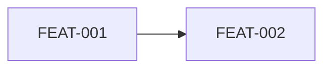
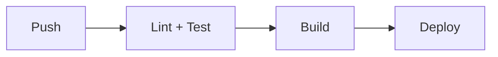
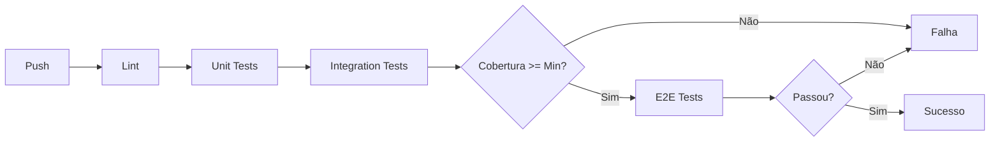

# AGENT-DOC — Templates de Artefatos

> **Quando usar:** FASE 4 para gerar os artefatos finais.
> **Carregue com:** `@AGENT-DOC-TEMPLATES.MD`

---

## Estrutura `.cursor/rules/` (moderna)

```
.cursor/rules/
├── project-context.md      # alwaysApply: true
├── security.md             # alwaysApply: true
├── implementation.md       # alwaysApply: true — DOD, Git, Métricas
├── learnings.md            # alwaysApply: true
├── api-conventions.mdc     # globs: ["**/api/**", "**/routes/**"]
├── database.mdc            # globs: ["**/db/**", "**/models/**", "**/prisma/**"]
├── testing.mdc             # globs: ["**/test*/**", "**/*test*", "**/*spec*"]
└── frontend.mdc            # globs: ["**/components/**", "**/pages/**"]
```

### Formato de arquivo de regra

```markdown
---
description: Breve descrição da regra
globs: ["**/api/**", "**/routes/**"]  # OU alwaysApply: true
---

# Título da Regra

## Contexto
[Quando esta regra se aplica]

## Regras
- DEVE ...
- NÃO DEVE ...

## Exemplos
[Código quando relevante]
```

### Globs Dinâmicos (flexíveis para diferentes estruturas)

Os globs DEVEM ser flexíveis para suportar diferentes estruturas de projeto:

| Arquivo | Globs recomendados | Estruturas suportadas |
|---------|-------------------|----------------------|
| `api-conventions.mdc` | `["**/api/**", "**/routes/**", "**/handlers/**", "**/features/**/routes*"]` | /src/api/, /src/routes/, /src/features/auth/routes.py |
| `database.mdc` | `["**/db/**", "**/models/**", "**/prisma/**", "**/migrations/**", "**/entities/**"]` | /src/db/, /prisma/, /src/models/ |
| `testing.mdc` | `["**/test*/**", "**/*test*", "**/*spec*", "**/conftest.py", "**/__tests__/**"]` | /tests/, *.test.ts, *.spec.ts, conftest.py |
| `frontend.mdc` | `["**/components/**", "**/pages/**", "**/views/**", "**/screens/**"]` | /src/components/, /pages/, /src/views/ |

**Anti-pattern:** NÃO usar globs que assumem estrutura específica inexistente (ex: `src/features/**` quando estrutura é `src/modules/**`).

### Conteúdo mínimo por arquivo

| Arquivo | Conteúdo obrigatório |
|---------|---------------------|
| `project-context.md` | Contexto, Perfil, **Stack com VERSÕES FIXADAS**, Estrutura, **Workflow de implementação** |
| `implementation.md` | Git Workflow, Definition of Done (DOD), Clarification para implementação, Métricas |
| `security.md` | Regras de segurança, Classificação de dados, Ações proibidas, Checkpoints |
| `api-conventions.mdc` | Padrão de rotas, Formato request/response, Padrão de erros, Validação |
| `database.mdc` | Naming, Migrations, Constraints, Soft delete |
| `testing.mdc` | Framework, Cobertura mínima, Mocks, Estrutura |
| `learnings.md` | Erros conhecidos, Padrões que funcionam, Libs consultadas, Métricas |

---

## Template: `project-context.md` (com enforcement de versões)

```markdown
---
description: Contexto do projeto [Nome]
alwaysApply: true
---

# Project Context

## Resumo
[2-3 linhas sobre o projeto]

## Perfil
- **Tipo:** PESSOAL | INTERNO | PRODUCAO
- **Meta de qualidade:** 95%+ de precisão em decisões

## Stack (VERSÕES FIXADAS - OBRIGATÓRIO SEGUIR)

**ATENÇÃO:** As versões abaixo são OBRIGATÓRIAS. Antes de usar qualquer lib:
1. Verificar se está listada aqui
2. Se não estiver, consultar Context7 para versão compatível
3. Registrar em learnings.md antes de usar

| Componente | Tecnologia | Versão EXATA | Validação Context7 |
|------------|------------|--------------|-------------------|
| Runtime | Python | 3.11.x | ✅ Consultado |
| Framework | FastAPI | 0.109.x | ✅ Consultado |
| ORM | SQLModel | 0.0.14 | ✅ Consultado |
| Banco | PostgreSQL | 16.x | ✅ Consultado |
| [Adicionar conforme projeto] | | | |

**Anti-pattern:** NÃO usar versões diferentes sem atualizar esta tabela e registrar em ADR.

### Verificação de compatibilidade

Antes de `pip install` ou `npm install`:
1. Verificar se lib existe na tabela acima
2. Se não existir, usar Context7 para verificar compatibilidade
3. Adicionar à tabela após validação

## Estrutura de diretórios
\`\`\`
projeto/
├── src/
├── tests/
└── ...
\`\`\`

## Workflow de Implementação (OBRIGATÓRIO)

### Git (NUNCA codar em main)
1. Criar branch: `git checkout -b feat/FEAT-xxx-descricao`
2. Commits convencionais: `feat:`, `fix:`, `chore:`
3. Push e PR após DOD completo

### Antes de implementar QUALQUER task:

1. **PLAN mode obrigatório:**
   - Usar Cursor Plan mode
   - Listar arquivos que serão criados/modificados
   - Identificar dependências
   - Estimar complexidade

2. **Clarification Questions se:**
   - Contrato de API ambíguo
   - Múltiplas formas de implementar
   - Lib/versão não especificada
   - Comportamento de erro não definido

3. **Consultar Context7 ANTES de codar:**
   - Para cada lib usada
   - Validar sintaxe atual
   - Registrar em learnings.md

### Anti-patterns (PROIBIDO)
- ❌ Pular direto para implementação sem Plan
- ❌ Codar na branch main/master/develop
- ❌ Assumir versão de lib sem consultar Context7
- ❌ Marcar task como DONE sem executar DOD
- ❌ Ignorar testes definidos no PRD

## Referências
- PRD.md
- TECH_SPECS.md
- SECURITY_IMPLEMENTATION.md
- ADR.md
```

---

## Template: `.cursor/rules/implementation.md`

Regra **alwaysApply** que guia o agente durante a implementação (após documentação gerada). Inclui Git, DOD, Clarification e métricas.

```markdown
---
description: Workflow de implementação — Git, DOD, Clarification, Métricas (95%+ precisão)
alwaysApply: true
---

# Workflow de Implementação — [Nome do Projeto]

**Meta de qualidade:** 95%+ de precisão em decisões (sem retrabalho).

---

## 1. Git Workflow (OBRIGATÓRIO)

**NUNCA codar diretamente na branch principal (main/master/develop).**

### Antes de implementar QUALQUER task

1. Verificar branch: `git branch --show-current`
2. Se estiver em main/master/develop: `git checkout -b feat/FEAT-xxx-descricao` (ou fix/, chore/, docs/)
3. Validar branch antes de commitar: `git status`

### Padrão de nomenclatura

| Tipo | Padrão | Exemplo |
|------|--------|---------|
| Feature | feat/FEAT-xxx-descricao | feat/FEAT-001-autenticacao-pin |
| Bug fix | fix/BUG-xxx-descricao | fix/BUG-042-parcelas-incorretas |
| Refactor | refactor/descricao | refactor/extrair-servico-audio |
| Infra/Setup | chore/descricao | chore/docker-compose-setup |
| Docs | docs/descricao | docs/atualizar-readme |

### Workflow completo

\`\`\`bash
git checkout main && git pull origin main
git checkout -b feat/FEAT-xxx-descricao
# Implementar (commits frequentes: feat:, fix:, chore:)
make lint && make test && docker compose up -d
git push -u origin feat/FEAT-xxx-descricao
\`\`\`

### Anti-patterns (PROIBIDO)

- Codar na branch main/master/develop
- Branch sem prefixo (feat/, fix/, etc.) ou sem referência à task (FEAT-xxx, BUG-xxx)
- Commitar código que não passa no lint
- Push sem executar testes

---

## 2. Definition of Done (DOD) — Obrigatório

Uma task SÓ pode ser marcada como DONE quando TODOS os itens forem verificados.

### DOD Git (PRIMEIRO)
- [ ] Branch dedicada criada
- [ ] NÃO está em main/master/develop
- [ ] Commits seguem padrão convencional

### DOD Básico (todas as tasks)
- [ ] Código compila sem erros
- [ ] Lint passa sem erros críticos
- [ ] Formatação aplicada
- [ ] Tipos verificados (mypy / tsc --noEmit)

### DOD Funcional (features)
- [ ] Teste unitário existe e passa (mínimo happy path)
- [ ] Teste de integração existe (se API)
- [ ] Versões das libs conferem com TECH_SPECS.md
- [ ] Aplicação executa localmente (docker compose up -d ou equivalente)

### DOD Infra (setup/deploy)
- [ ] Container builda e inicia sem erro
- [ ] Health check responde
- [ ] Logs sem erros

### DOD Métricas
- [ ] Clarification Questions feitas quando necessário
- [ ] Precisão registrada em learnings.md
- [ ] Retrabalhos e causa registrados

### Comando de validação (antes de DONE)

\`\`\`bash
git branch --show-current   # NÃO deve ser main
make lint && make test && docker compose up -d && docker compose logs
# ou: npm run lint && npm test && docker compose up -d && docker compose logs
\`\`\`

**NUNCA marcar DONE sem:** (1) branch dedicada, (2) validação completa, (3) métricas em learnings.md.

---

## 3. Workflow por FEAT

Para cada FEAT-xxx do Task-Master:

1. **GIT:** Criar branch dedicada
2. **PLAN mode:** Ler PRD.md e TECH_SPECS.md da FEAT, listar dependências
3. **Clarification:** Perguntar ANTES de implementar se houver ambiguidade (ver seção 4)
4. **Context7:** Consultar sintaxe de libs, validar versão contra TECH_SPECS.md, registrar em learnings.md
5. **Implementar** seguindo DOD
6. **Validar** antes de DONE e registrar métricas

---

## 4. Clarification Questions para Implementação

### Gatilhos obrigatórios (perguntar ANTES de codar)

| Situação | Pergunta estruturada |
|----------|---------------------|
| Lib não especificada | "Qual lib usar para X?" → [Opção A / Opção B / Sugerir] |
| Versão ambígua | "TECH_SPECS diz 'X 1.x+', usar qual?" → [versão exata / última estável] |
| Múltiplas implementações | "Como implementar X?" → [Opção A / Opção B com prós/cons] |
| Comportamento não definido | "O que fazer quando Y?" → [Erro / Fallback / Ignorar] |
| Setup não especificado | "docker-compose deve incluir?" → [Apenas app / App+DB / App+DB+Redis] |
| Estrutura de diretórios | "Onde criar X?" → [caminho A / caminho B] |

### Triggers automáticos

- Versão ambígua ("1.x+", "Python 3.11+") → "Qual versão exata devo usar?"
- Config não especificada (ausência docker-compose, .env.example) → "Devo criar configuração? Quais serviços?"
- Múltiplas libs possíveis → "Qual lib usar? [lista]"
- Cenário não coberto em PRD/TECH_SPECS → "O que fazer quando X acontecer?"

### Formato de Clarification

\`\`\`markdown
**Contexto:** Implementando FEAT-xxx | **Documento:** TECH_SPECS.md
**Pergunta 1:** [clara] — [ ] Opção A  [ ] Opção B  [ ] Outra
**Impacto se não perguntar:** [risco]
\`\`\`

---

## 5. Checklist por Task

### Antes de começar
- [ ] Branch dedicada criada
- [ ] Li FEAT-xxx no PRD.md e API-xxx no TECH_SPECS.md
- [ ] Identifiquei RULE-xxx e TEST-xxx
- [ ] PLAN mode usado
- [ ] Clarification feita se necessário

### Durante implementação
- [ ] Context7 consultado para libs novas
- [ ] Versões conferem com TECH_SPECS.md
- [ ] Contrato de API seguido
- [ ] Códigos de erro corretos

### Antes de DONE
- [ ] lint, format, type-check passam
- [ ] Testes unitários e integração passam
- [ ] Aplicação executa localmente
- [ ] Métricas em learnings.md

---

## 6. Métricas (Meta: 95%+ precisão)

Precisão = (Decisões corretas na 1ª tentativa) / (Total de decisões). Registrar em learnings.md:

\`\`\`markdown
## Métricas FEAT-xxx
| Métrica | Valor |
| Clarification Questions feitas | X |
| Decisões que precisaram retrabalho | Y |
| Precisão | (X-Y)/X * 100% |
| Causa dos retrabalhos | [lista] |
\`\`\`

---

## 7. Consulta de documentação

Para implementar FEAT-xxx: @PRD.md (FEAT-xxx), @TECH_SPECS.md (API-xxx, modelo de dados), @SECURITY_IMPLEMENTATION.md, @ADR.md.

---

## 8. Anti-patterns (PROIBIDO)

- Codar em main; pular Plan; assumir versão sem Context7; marcar DONE sem DOD; ignorar testes do PRD; não registrar métricas; assumir quando há ambiguidade (perguntar).
```

---

## Template: `PRD.md`

```markdown
# PRD — [Nome do Projeto]

> **Resumo executivo (max 150 tokens):** [Resumo para referência rápida]

## 1. Visão geral
[1 parágrafo]

## 2. Classificação do projeto
- **Perfil:** PESSOAL | INTERNO | PRODUCAO (informado pelo solicitante)

## 3. Objetivos e não-objetivos
### Objetivos (MVP)
- ...

### Não-objetivos (fora do escopo)
- ...

## 4. Personas/papéis
| Persona | Descrição | Permissões |
|---------|-----------|------------|

## 5. User stories
### FEAT-001: [Título]
**Como** [persona], **quero** [ação], **para** [benefício].

#### Critérios de aceite (Gherkin)
```gherkin
# Happy path
Given [contexto]
When [ação]
Then [resultado esperado]

# Unhappy path
Given [contexto]
When [ação inválida]
Then [erro esperado com code]
```

#### Regras de negócio
- RULE-001: [descrição]

#### Testes associados
- TEST-001: [cenário]

## 6. Grafo de dependências


## 7. Regras de negócio consolidadas
| ID | Regra | Features | Erro se violada |
|----|-------|----------|-----------------|

## 8. Mapa de erros
| Code | Severity | Quando ocorre | Status | i18nKey |
|------|----------|---------------|--------|---------|

## 9. Métricas de sucesso
| Métrica | Baseline | Target | Como medir |
|---------|----------|--------|------------|
```

---

## Template: `TECH_SPECS.md`

```markdown
# Tech Specs — [Nome do Projeto]

> **Resumo executivo (max 150 tokens):** [Resumo]

## 1. Arquitetura
### Diagrama
```mermaid
[diagrama de componentes]
```

### Componentes
| Componente | Responsabilidade | Tecnologia |
|------------|------------------|------------|

## 2. Modelo de dados
### Entidade: [Nome]
```json
{
  "$schema": "http://json-schema.org/draft-07/schema#",
  "type": "object",
  "properties": {
    "id": { "type": "string", "format": "uuid" },
    "email": { 
      "type": "string", 
      "format": "email",
      "x-pii": true,
      "x-normalize": ["trim", "lowercase"]
    }
  },
  "required": ["id", "email"]
}
```

### Diagrama ER
```mermaid
erDiagram
[diagrama]
```

## 3. Contrato de API
### API-001: [Nome]
- **FEAT:** FEAT-001
- **Método:** POST
- **Path:** /api/v1/resource
- **Auth:** Bearer JWT (roles: admin, user)

#### Request
```json
{ "email": "usuario@exemplo.com" }
```

#### Response (200)
```json
{ "id": "uuid", "email": "usuario@exemplo.com" }
```

#### Response (400)
```json
{
  "code": "USER.INVALID_EMAIL",
  "message": "Email inválido",
  "severity": "WARNING",
  "traceId": "uuid"
}
```

#### Validações
| Campo | Tipo | Obrigatório | Limites | Normalização | Erro |
|-------|------|-------------|---------|--------------|------|

## 4. Integrações externas
| Integração | Tipo | Timeout | Retries | Fallback |
|------------|------|---------|---------|----------|

## 5. Requisitos não-funcionais
| Requisito | Valor | Perfil | Como validar |
|-----------|-------|--------|--------------|

## 6. Estratégia de testes
| FEAT | TEST IDs | Tipo | Cenários |
|------|----------|------|----------|

## 7. Matriz de rastreabilidade
| FEAT | RULE | API | TEST | ADR |
|------|------|-----|------|-----|

## 8. Mapa de erros consolidado
| Code | Severity | HTTP | Quando | Exemplo |
|------|----------|------|--------|---------|
```

---

## Template: `SECURITY_IMPLEMENTATION.md`

```markdown
# Security Implementation — [Nome do Projeto]

> **Resumo executivo (max 150 tokens):** [Resumo]

## 1. Threat model
### Ativos
| Ativo | Classificação | Impacto se comprometido |
|-------|---------------|-------------------------|

### Vetores de ataque
| Vetor | Ativo alvo | Mitigação | FEAT relacionada |
|-------|------------|-----------|------------------|

## 2. Classificação de dados
| Dado | Classificação | Retenção | Minimização | Criptografia |
|------|---------------|----------|-------------|--------------|

## 3. AuthN (Autenticação)
### Configurações
| Parâmetro | Valor | Justificativa |
|-----------|-------|---------------|
| JWT expiry | 1h | Balance segurança/UX |
| Hash algorithm | Argon2id | OWASP recomendado |

## 4. AuthZ (Autorização)
### Matriz de permissões (RBAC)
| Role | FEAT-001 | FEAT-002 | API-001 |
|------|----------|----------|---------|
| admin | ✓ | ✓ | ✓ |
| user | ✓ | - | ✓ |

## 5. OWASP Top 10
| # | Vulnerabilidade | Aplica? | Mitigação | Onde |
|---|-----------------|---------|-----------|------|

## 6. Rate limiting
| Endpoint | Limite | Janela | Ação se exceder |
|----------|--------|--------|-----------------|

## 7. Logging seguro
| Evento | Dados logados | NUNCA logar |
|--------|---------------|-------------|

## 8. Gestão de segredos
| Segredo | Onde armazenar | Rotação | Acesso |
|---------|----------------|---------|--------|

## 9. Resposta a incidentes
| Severidade | Critério | Tempo resposta | Quem acionar |
|------------|----------|----------------|--------------|
```

---

## Template: `INFRASTRUCTURE.md` (se perfil ≠ PESSOAL)

```markdown
# Infrastructure — [Nome do Projeto]

> **Resumo executivo (max 150 tokens):** [Resumo]

## 1. Ambientes
| Ambiente | URL | Propósito | Quem acessa |
|----------|-----|-----------|-------------|

## 2. Variáveis de ambiente
| Variável | Obrigatória | Exemplo | Onde obter |
|----------|-------------|---------|------------|

## 3. Dependências de infraestrutura
| Serviço | Versão | Propósito | Fallback |
|---------|--------|-----------|----------|

## 4. CI/CD Pipeline


## 5. Deploy
### Comandos
```bash
# Build
docker build -t app:latest .

# Deploy
kubectl apply -f k8s/
```

### Checklist pré-deploy
- [ ] Migrations executadas
- [ ] Variáveis configuradas
- [ ] Rollback plan documentado

## 6. Rollback
1. Identificar versão anterior
2. Executar rollback
3. Verificar health checks

## 7. Monitoramento
| Métrica | Threshold | Alerta | Ação |
|---------|-----------|--------|------|

## 8. Backup e Recovery
| Dado | Frequência | Retenção | RTO | RPO |
|------|------------|----------|-----|-----|
```

---

## Template: `ADR.md`

Mínimo 3 ADRs com:

```markdown
## ADR-001: [Título da decisão]

**Status:** Proposta | Aceito | Deprecado  
**Data:** YYYY-MM-DD  
**Decisores:** [quem decidiu]

### Contexto
[Por que essa decisão é necessária]

### Decisão
[O que foi decidido]

### Alternativas consideradas
| Opção | Prós | Contras |
|-------|------|---------|

### Consequências
**Ganhos:**
- ...

**Perdas:**
- ...

**Riscos:**
- ...
```

---

## Template: `TESTING_STRATEGY.md` (se perfil ≥ INTERNO)

```markdown
# Testing Strategy — [Nome do Projeto]

> **Resumo executivo (max 150 tokens):** [Resumo da estratégia de testes]

## 1. Cobertura por Feature

| FEAT | Testes Unit | Testes Integration | Testes E2E | Cobertura Alvo |
|------|-------------|---------------------|------------|----------------|
| FEAT-001 | TEST-010, TEST-011 | TEST-001, TEST-002 | TEST-100 | 80% |
| FEAT-002 | TEST-020 | TEST-003, TEST-004 | - | 60% |

## 2. Configuração de CI

### Pipeline de Testes



### Configuração

| Ambiente | Comando | Cobertura Mínima | Timeout |
|----------|---------|-------------------|---------|
| CI | `npm test -- --coverage` | 60% (INTERNO) / 80% (PRODUCAO) | 10min |
| Pre-commit | `npm test -- --run` | - | 2min |
| Smoke | `npm run test:smoke` | - | 1min |

## 3. Smoke Tests

Testes críticos executados antes de cada deploy:

| TEST | Descrição | Criticidade |
|------|-----------|-------------|
| TEST-001 | Criar projeto válido | P0 |
| TEST-100 | Fluxo completo de login | P0 |
| TEST-002 | Erro ao criar projeto duplicado | P1 |

**Script:** `./scripts/smoke-test.sh`

## 4. Fixtures e Mocks

### Fixtures Padronizadas

```typescript
// tests/fixtures/users.ts
export const adminUser = {
  id: 'admin-uuid',
  email: 'admin@test.com',
  role: 'admin',
};

export const regularUser = {
  id: 'user-uuid',
  email: 'user@test.com',
  role: 'user',
};
```

### Mocks Padronizados

```typescript
// tests/mocks/prisma.ts
export const mockPrisma = {
  project: {
    create: vi.fn(),
    findUnique: vi.fn(),
  },
};
```

## 5. Estratégia de Regressão

### Antes de Nova Feature

1. ✅ Rodar suite completa
2. ✅ Todos devem passar (baseline)
3. ✅ Registrar tempo de execução

### Após Implementar Feature

1. ✅ Rodar suite completa novamente
2. ✅ Comparar com baseline
3. ✅ Se algum teste falhou → **BUG DE REGRESSÃO**

### CI/CD

- Pipeline DEVE bloquear merge se testes falharem
- Smoke tests executados em cada PR
- Suite completa antes de merge em main

## 6. Ferramentas

| Ferramenta | Versão | Uso |
|------------|--------|-----|
| Vitest | 1.x | Framework de testes |
| @vitest/coverage-v8 | 1.x | Cobertura de código |
| Playwright | 1.x | Testes E2E |
| MSW | 2.x | Mock de APIs |

## 7. Comandos Úteis

```bash
# Rodar todos os testes
npm test

# Rodar com cobertura
npm test -- --coverage

# Rodar apenas unitários
npm test -- --grep "unit"

# Rodar apenas integration
npm test -- --grep "integration"

# Rodar smoke tests
npm run test:smoke

# Rodar em modo watch
npm test -- --watch
```
```

---

## Template: `.cursor/rules/learnings.md`

```markdown
---
description: Lições aprendidas, métricas e erros a evitar
alwaysApply: true
---

# Learnings — [Nome do Projeto]

## Métricas de Qualidade (Meta: 95%+ precisão)

### Métricas Gerais
| Métrica | Valor | Meta |
|---------|-------|------|
| Total de Clarification Questions | 0 | - |
| Precisão média | -% | 95%+ |
| Tasks sem retrabalho | -% | 90%+ |

### Por FEAT
| FEAT | Questions | Retrabalhos | Precisão | Data |
|------|-----------|-------------|----------|------|
| FEAT-xxx | 0 | 0 | -% | YYYY-MM-DD |

### Template para registrar métricas por FEAT

\`\`\`markdown
## Métricas FEAT-xxx (YYYY-MM-DD)

| Métrica | Valor |
|---------|-------|
| Clarification Questions feitas | X |
| Decisões que precisaram retrabalho | Y |
| Precisão | (X-Y)/X * 100% |
| Causa dos retrabalhos | [lista] |
\`\`\`

---

## Erros Conhecidos

| Data | Erro | Solução | Contexto | FEAT/API |
|------|------|---------|----------|----------|
| YYYY-MM-DD | [Descrição do erro] | [Solução encontrada] | [Contexto onde ocorreu] | FEAT-xxx / API-xxx |

**Exemplo:**
| Data | Erro | Solução | Contexto | FEAT/API |
|------|------|---------|----------|----------|
| 2024-01-15 | Prisma N+1 query | Usar `include` ao invés de queries separadas | API-001 | FEAT-001 |

---

## Padrões que Funcionam

### Padrão: [Nome do Padrão]

**Quando usar:** [Contexto específico]

**Como:** [Descrição de como implementar]

**Exemplo:**
\`\`\`typescript
// Código de exemplo
\`\`\`

**Funciona bem para:** [Casos de uso]

---

## Libs Consultadas (Cache)

| Lib | Versão | Doc URL | Última Consulta | Notas |
|-----|--------|---------|-----------------|-------|
| [Nome] | [Versão] | [URL] | YYYY-MM-DD | [Notas relevantes] |

**Exemplo:**
| Lib | Versão | Doc URL | Última Consulta | Notas |
|-----|--------|---------|-----------------|-------|
| FastAPI | 0.109.x | https://fastapi.tiangolo.com | 2024-01-15 | Async, Pydantic v2 |

**Regra:** Consultar Context7 ANTES de usar lib. Registrar aqui APÓS consulta.

---

## Decisões de Design

| Data | Decisão | Justificativa | ADR |
|------|---------|---------------|-----|
| YYYY-MM-DD | [Decisão] | [Por que] | ADR-xxx |

---

## Consultas de API Externa

| API | Endpoint | Método | Última Consulta | Resposta Esperada |
|-----|----------|--------|-----------------|-------------------|
| [Nome] | [Path] | GET/POST/etc | YYYY-MM-DD | [Status + formato] |

---

## Comandos Úteis

| Comando | Quando usar | Resultado |
|---------|-------------|-----------|
| `git branch --show-current` | Verificar branch atual | Nome da branch |
| `make lint && make test` | Validar antes de DONE | Lint + testes passam |
| `docker compose up -d` | Testar localmente | App rodando |

---

## Notas de Debug

| Data | Problema | Solução | Ferramenta |
|------|----------|---------|------------|
| YYYY-MM-DD | [Problema] | [Solução] | [Ferramenta usada] |

---

## Relatório de Qualidade (preencher ao final do projeto)

### Lições Aprendidas
- [O que funcionou bem]
- [O que melhorar]

### Recomendações para próximo projeto
- [Recomendação 1]
- [Recomendação 2]
```

---

## Estrutura atualizada `.cursor/rules/`

```
.cursor/rules/
├── project-context.md      # alwaysApply: true
├── security.md             # alwaysApply: true
├── implementation.md       # alwaysApply: true — DOD, Git, Métricas
├── learnings.md            # alwaysApply: true
├── api-conventions.mdc     # globs: ["**/api/**", "**/routes/**"]
├── database.mdc            # globs: ["**/db/**", "**/models/**", "**/prisma/**"]
├── testing.mdc             # globs: ["**/test*/**", "**/*test*", "**/*spec*"]
└── frontend.mdc            # globs: ["**/components/**", "**/pages/**"]
```
