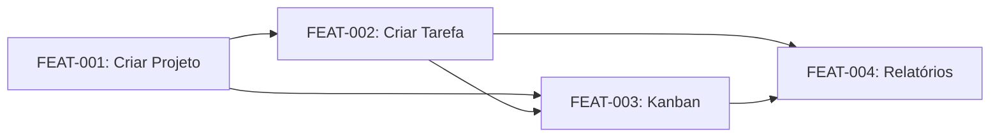

# Exemplo: PRD.md — TaskFlow

> **Carregue com:** `@examples/EXAMPLES-PRD.MD`

---

```markdown
# PRD — TaskFlow

> **Resumo executivo:** Sistema de gerenciamento de tarefas para equipes de 2-50 pessoas. 
> Permite criar projetos, atribuir tarefas, acompanhar progresso e gerar relatórios simples. 
> Perfil INTERNO, sem exposição pública, autenticação via SSO corporativo.

## 1. Visão Geral

TaskFlow é uma ferramenta interna de gerenciamento de tarefas que permite equipes 
organizarem seu trabalho em projetos e tarefas. O sistema oferece visão kanban, 
atribuição de responsáveis, datas de entrega e relatórios de progresso.

## 2. Classificação do Projeto

- **Perfil:** INTERNO
- **Justificativa:**
  - Usuários: 2-50 (equipe corporativa)
  - Exposição: Rede interna apenas
  - PII: Apenas de colaboradores (nome, email corporativo)
  - SLA: Não formal, mas disponibilidade em horário comercial
  - Impacto de falha: Operacional (atraso em entregas)

## 3. Objetivos e Não-Objetivos

### Objetivos (MVP)
- Permitir criação de projetos e tarefas
- Permitir atribuição de tarefas a membros da equipe
- Visualização kanban de tarefas por status
- Notificações por email em atribuições
- Relatório simples de tarefas por período

### Não-Objetivos (fora do escopo)
- Integração com ferramentas externas (Slack, Jira)
- App mobile nativo
- Funcionalidades de chat/comentários em tempo real
- Gestão de horas/timesheet

## 4. Personas/Papéis

| Persona | Descrição | Permissões |
|---------|-----------|------------|
| Admin | Administrador do sistema | CRUD projetos, CRUD usuários, todas as tarefas |
| Manager | Gestor de projetos | CRUD tarefas em seus projetos, visualizar relatórios |
| Member | Membro da equipe | CRUD próprias tarefas, visualizar projetos atribuídos |

## 5. User Stories

### FEAT-001: Criar Projeto

**Como** Admin ou Manager, **quero** criar um novo projeto, **para** organizar as tarefas da equipe.

#### Critérios de Aceite (Gherkin)

```gherkin
# Happy path 1: Criação com dados mínimos
Given um usuário autenticado com role "admin" ou "manager"
When ele envia POST /api/v1/projects com { "name": "Projeto Alpha", "description": "Descrição" }
Then o sistema retorna 201 Created
And o response contém o projeto criado com id, name, description, createdAt
And o usuário é automaticamente adicionado como owner do projeto

# Happy path 2: Criação com membros iniciais
Given um usuário autenticado com role "admin"
When ele envia POST /api/v1/projects com { "name": "Projeto Beta", "memberIds": ["uuid1", "uuid2"] }
Then o sistema retorna 201 Created
And os usuários uuid1 e uuid2 são adicionados como members do projeto

# Unhappy path 1: Nome duplicado
Given um projeto com nome "Projeto Alpha" já existe
When um usuário tenta criar outro projeto com nome "Projeto Alpha"
Then o sistema retorna 409 Conflict
And o response contém { "code": "PROJECT.NAME_TAKEN", "severity": "WARNING" }

# Unhappy path 2: Nome vazio
Given um usuário autenticado
When ele envia POST /api/v1/projects com { "name": "", "description": "Desc" }
Then o sistema retorna 400 Bad Request
And o response contém { "code": "VALIDATION.INVALID_INPUT", "details": [{ "field": "name" }] }

# Unhappy path 3: Sem permissão
Given um usuário autenticado com role "member"
When ele tenta criar um projeto
Then o sistema retorna 403 Forbidden
And o response contém { "code": "AUTH.FORBIDDEN" }
```

#### Regras de Negócio
- RULE-001: Nome do projeto DEVE ter entre 3 e 100 caracteres
- RULE-002: Nome do projeto DEVE ser único no sistema
- RULE-003: Criador do projeto é automaticamente owner

#### Testes Associados
- TEST-001: Criação de projeto com dados válidos (201)
- TEST-002: Criação de projeto com membros iniciais (201)
- TEST-003: Erro ao criar projeto com nome duplicado (409)
- TEST-004: Erro ao criar projeto com nome vazio (400)
- TEST-005: Erro ao criar projeto sem permissão (403)

---

### FEAT-002: Criar Tarefa

**Como** membro do projeto, **quero** criar uma tarefa, **para** registrar trabalho a ser feito.

#### Critérios de Aceite (Gherkin)

```gherkin
# Happy path 1: Tarefa simples
Given um usuário membro do projeto "proj-123"
When ele envia POST /api/v1/projects/proj-123/tasks com { "title": "Implementar login", "status": "TODO" }
Then o sistema retorna 201 Created
And a tarefa é criada com status "TODO" e sem assignee

# Happy path 2: Tarefa com assignee e deadline
Given um usuário membro do projeto "proj-123"
And existe um usuário "user-456" membro do mesmo projeto
When ele envia POST com { "title": "Review PR", "assigneeId": "user-456", "deadline": "2024-02-01" }
Then o sistema retorna 201 Created
And um email de notificação é enviado para "user-456"

# Unhappy path 1: Assignee não é membro do projeto
Given um usuário membro do projeto "proj-123"
And existe um usuário "user-789" que NÃO é membro do projeto
When ele tenta criar tarefa com assigneeId "user-789"
Then o sistema retorna 422 Unprocessable Entity
And o response contém { "code": "TASK.ASSIGNEE_NOT_MEMBER" }

# Unhappy path 2: Deadline no passado
Given um usuário membro do projeto
When ele tenta criar tarefa com deadline "2020-01-01"
Then o sistema retorna 400 Bad Request
And o response contém { "code": "VALIDATION.INVALID_INPUT", "details": [{ "field": "deadline", "code": "DATE_IN_PAST" }] }

# Unhappy path 3: Projeto não existe
Given um usuário autenticado
When ele tenta criar tarefa em projeto "inexistente-123"
Then o sistema retorna 404 Not Found
And o response contém { "code": "PROJECT.NOT_FOUND" }
```

#### Regras de Negócio
- RULE-004: Título da tarefa DEVE ter entre 5 e 200 caracteres
- RULE-005: Status inicial DEVE ser um de: TODO, IN_PROGRESS, REVIEW, DONE
- RULE-006: Assignee DEVE ser membro do projeto
- RULE-007: Deadline, se informado, DEVE ser data futura

#### Testes Associados
- TEST-006: Criação de tarefa simples (201)
- TEST-007: Criação de tarefa com assignee (201 + email)
- TEST-008: Erro assignee não membro (422)
- TEST-009: Erro deadline no passado (400)
- TEST-010: Erro projeto não encontrado (404)

---

### FEAT-003: Visualizar Kanban

**Como** membro do projeto, **quero** ver as tarefas em formato kanban, **para** acompanhar o progresso.

#### Critérios de Aceite (Gherkin)

```gherkin
# Happy path 1: Visualização padrão
Given um usuário membro do projeto "proj-123"
And o projeto tem 10 tarefas em diferentes status
When ele acessa GET /api/v1/projects/proj-123/tasks?view=kanban
Then o sistema retorna 200 OK
And as tarefas são agrupadas por status (TODO, IN_PROGRESS, REVIEW, DONE)
And cada grupo contém as tarefas ordenadas por deadline (mais urgente primeiro)

# Happy path 2: Filtro por assignee
Given um usuário membro do projeto
When ele acessa GET /api/v1/projects/proj-123/tasks?view=kanban&assigneeId=user-456
Then apenas tarefas atribuídas a "user-456" são retornadas

# Unhappy path 1: Projeto não encontrado
Given um usuário autenticado
When ele acessa GET /api/v1/projects/inexistente/tasks?view=kanban
Then o sistema retorna 404 Not Found

# Unhappy path 2: Usuário não é membro
Given um usuário autenticado que NÃO é membro do projeto "proj-123"
When ele tenta acessar o kanban do projeto
Then o sistema retorna 403 Forbidden
And o response contém { "code": "AUTH.FORBIDDEN" }
```

#### Regras de Negócio
- RULE-008: Usuário só pode ver kanban de projetos onde é membro
- RULE-009: Tarefas são ordenadas por deadline dentro de cada coluna

#### Testes Associados
- TEST-011: Visualização kanban com tarefas (200)
- TEST-012: Filtro por assignee (200)
- TEST-013: Erro projeto não encontrado (404)
- TEST-014: Erro usuário não membro (403)

## 6. Grafo de Dependências



**Ordem de implementação:** FEAT-001 → FEAT-002 → FEAT-003 → FEAT-004

## 7. Regras de Negócio Consolidadas

| ID | Regra | Features | Erro se violada |
|----|-------|----------|-----------------|
| RULE-001 | Nome projeto: 3-100 chars | FEAT-001 | VALIDATION.INVALID_INPUT |
| RULE-002 | Nome projeto único | FEAT-001 | PROJECT.NAME_TAKEN |
| RULE-003 | Criador é owner | FEAT-001 | - |
| RULE-004 | Título tarefa: 5-200 chars | FEAT-002 | VALIDATION.INVALID_INPUT |
| RULE-005 | Status válido | FEAT-002 | VALIDATION.INVALID_INPUT |
| RULE-006 | Assignee é membro | FEAT-002 | TASK.ASSIGNEE_NOT_MEMBER |
| RULE-007 | Deadline futura | FEAT-002 | VALIDATION.INVALID_INPUT |
| RULE-008 | Acesso só para membros | FEAT-003 | AUTH.FORBIDDEN |
| RULE-009 | Ordenação por deadline | FEAT-003 | - |

## 8. Mapa de Erros

| Code | Severity | Quando ocorre | HTTP Status | i18nKey |
|------|----------|---------------|-------------|---------|
| AUTH.UNAUTHORIZED | ERROR | Token ausente/inválido | 401 | errors.auth.unauthorized |
| AUTH.FORBIDDEN | WARNING | Sem permissão para ação | 403 | errors.auth.forbidden |
| VALIDATION.INVALID_INPUT | WARNING | Dados de entrada inválidos | 400 | errors.validation.invalid_input |
| PROJECT.NOT_FOUND | WARNING | Projeto não existe | 404 | errors.project.not_found |
| PROJECT.NAME_TAKEN | WARNING | Nome de projeto duplicado | 409 | errors.project.name_taken |
| TASK.NOT_FOUND | WARNING | Tarefa não existe | 404 | errors.task.not_found |
| TASK.ASSIGNEE_NOT_MEMBER | WARNING | Assignee não é membro | 422 | errors.task.assignee_not_member |
| INTERNAL.SERVER_ERROR | CRITICAL | Erro interno | 500 | errors.internal.server_error |

## 9. Métricas de Sucesso

| Métrica | Baseline | Target | Como medir |
|---------|----------|--------|------------|
| Tarefas criadas/semana | 0 | 50+ | Query no banco |
| Tempo médio de conclusão | N/A | < 5 dias | Analytics |
| Adoção (usuários ativos) | 0 | 80% do time | Login tracking |
| NPS | N/A | > 7 | Survey mensal |
```
