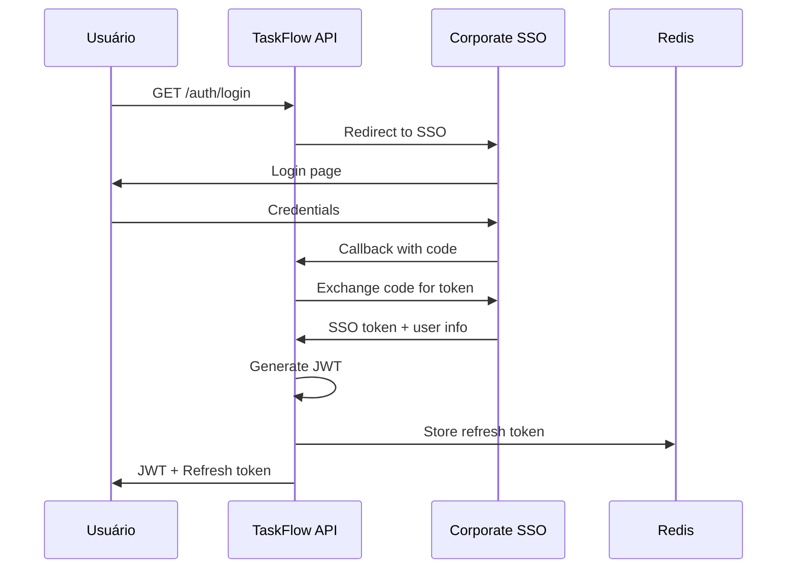

# Exemplo: SECURITY_IMPLEMENTATION.md — TaskFlow

> **Carregue com:** `@examples/EXAMPLES-SECURITY.MD`

---

```markdown
# Security Implementation — TaskFlow

> **Resumo executivo:** Sistema interno com autenticação via SSO corporativo. 
> PII limitada a dados de colaboradores (nome, email). 
> Foco em autorização (RBAC) e logging para auditoria.

## 1. Threat Model

### Ativos

| Ativo | Classificação | Impacto se comprometido |
|-------|---------------|-------------------------|
| Credenciais de usuário | Sensível | Acesso não autorizado |
| Dados de projetos/tarefas | Interno | Vazamento de informação |
| Email/nome de colaboradores | PII | Compliance LGPD |
| Tokens JWT | Sensível | Impersonation |

### Atacantes

| Tipo | Motivação | Capacidade |
|------|-----------|------------|
| Colaborador malicioso | Acesso a dados de outros | Acesso interno |
| Ex-colaborador | Vingança, espionagem | Credenciais antigas |
| Atacante externo | Dados corporativos | Limitado (rede interna) |

### Vetores de Ataque

| Vetor | Ativo alvo | Mitigação | FEAT relacionada |
|-------|------------|-----------|------------------|
| Escalação de privilégios | Dados | RBAC rigoroso | FEAT-001, FEAT-002 |
| Token roubado | Sessão | Expiração curta, refresh rotation | Auth |
| Injeção SQL | Banco | Prisma ORM | FEAT-001, FEAT-002 |
| IDOR | Dados | Ownership check | FEAT-002, FEAT-003 |

## 2. Classificação de Dados

| Dado | Classificação | Retenção | Minimização | Criptografia |
|------|---------------|----------|-------------|--------------|
| email | PII | Enquanto ativo + 90d | Não | TLS em trânsito |
| nome | PII | Enquanto ativo + 90d | Não | TLS em trânsito |
| senha | N/A (SSO) | - | - | - |
| projetos | Interno | Indefinido | - | - |
| tarefas | Interno | Indefinido | - | - |
| audit_logs | Interno | 2 anos | - | - |

## 3. AuthN (Autenticação)

### Fluxo



### Configurações

| Parâmetro | Valor | Justificativa |
|-----------|-------|---------------|
| JWT expiry | 1h | Balance segurança/UX interno |
| Refresh expiry | 8h | Dia de trabalho |
| JWT algorithm | RS256 | Assimétrico, validação sem secret |
| Refresh rotation | Sim | Mitiga token roubado |

## 4. AuthZ (Autorização)

### Matriz de Permissões (RBAC)

| Role | Criar projeto | Ver todos projetos | Gerenciar membros | Criar tarefa | Ver tarefas | Deletar tarefa |
|------|---------------|--------------------|--------------------|--------------|-------------|----------------|
| admin | ✓ | ✓ | ✓ | ✓ (todos) | ✓ (todos) | ✓ (todos) |
| manager | ✓ | Só seus | ✓ (seus projetos) | ✓ (seus) | ✓ (seus) | ✓ (seus) |
| member | - | Só membros | - | ✓ (membros) | ✓ (membros) | Só próprias |

### Ownership Check

```typescript
// Toda operação em recurso DEVE verificar ownership
async function checkTaskAccess(userId: string, taskId: string) {
  const task = await prisma.task.findUnique({
    where: { id: taskId },
    include: { project: { include: { members: true } } },
  });
  
  if (!task) throw new NotFoundError('TASK.NOT_FOUND');
  
  const isMember = task.project.members.some(m => m.userId === userId);
  if (!isMember) throw new ForbiddenError('AUTH.FORBIDDEN');
  
  return task;
}
```

## 5. OWASP Top 10 — Aplicação Contextual

| # | Vulnerabilidade | Aplica? | Mitigação | Onde |
|---|-----------------|---------|-----------|------|
| A01 | Broken Access Control | ✓ | RBAC + ownership check em toda rota | Middleware |
| A02 | Cryptographic Failures | ✓ | TLS 1.3, JWT RS256 | Infra + Auth |
| A03 | Injection | ✓ | Prisma ORM (prepared statements) | DB layer |
| A04 | Insecure Design | ✓ | Threat model, security review | Design phase |
| A05 | Security Misconfiguration | ✓ | Helmet, CORS restrito, headers | Config |
| A06 | Vulnerable Components | ✓ | npm audit, Dependabot | CI/CD |
| A07 | Auth Failures | ✓ | SSO corporativo, JWT curto | Auth |
| A08 | Data Integrity Failures | ✓ | Validação Zod em todo input | API layer |
| A09 | Logging Failures | ✓ | Structured logging, audit trail | Logging |
| A10 | SSRF | Baixo risco | Sem chamadas externas arbitrárias | - |

## 6. Rate Limiting

| Endpoint | Limite | Janela | Ação se exceder |
|----------|--------|--------|-----------------|
| /auth/* | 10 req | 1min | 429 + block 5min |
| /api/* (autenticado) | 200 req | 1min | 429 + Retry-After |

## 7. Logging Seguro

### O que logar

| Evento | Dados logados | Dados NUNCA logados |
|--------|---------------|---------------------|
| Login/Logout | userId, timestamp, IP | tokens, senhas |
| CRUD projeto | userId, projectId, action | - |
| CRUD tarefa | userId, taskId, action | - |
| Erro authZ | userId, resource, attemptedAction | - |

### Formato

```json
{
  "timestamp": "2024-01-15T10:30:00.000Z",
  "traceId": "uuid",
  "level": "INFO",
  "event": "task.created",
  "userId": "user-uuid",
  "projectId": "project-uuid",
  "taskId": "task-uuid",
  "ip": "10.0.0.50",
  "userAgent": "Mozilla/5.0..."
}
```

## 8. Gestão de Segredos

| Segredo | Onde armazenar | Rotação | Acesso |
|---------|----------------|---------|--------|
| JWT private key | Vault | 30 dias | Auth service |
| Database URL | Environment | 90 dias | API |
| SSO client secret | Vault | 90 dias | Auth service |

## 9. Resposta a Incidentes

### Classificação

| Severidade | Critério | Tempo resposta | Quem acionar |
|------------|----------|----------------|--------------|
| P1 | Vazamento de dados, acesso não autorizado | 30min | TI + Gestão |
| P2 | Sistema indisponível | 1h | TI |
| P3 | Bug de segurança sem exploração | 4h | Dev |

### Runbook

1. **Detectar:** Alerta de monitoring ou report de usuário
2. **Conter:** Revogar tokens suspeitos, bloquear usuário se necessário
3. **Investigar:** Analisar logs, identificar escopo
4. **Comunicar:** Informar gestão se P1/P2
5. **Corrigir:** Deploy de fix
6. **Documentar:** Post-mortem em 48h
```
