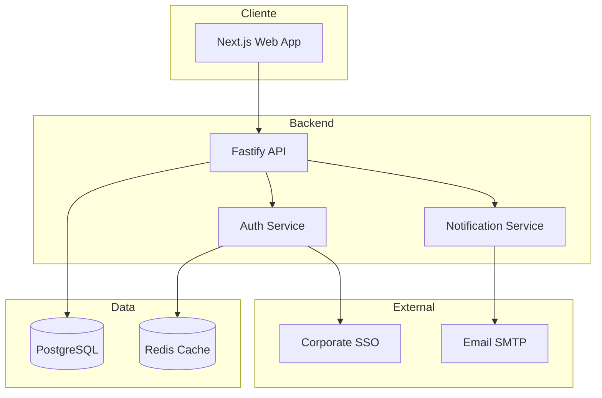
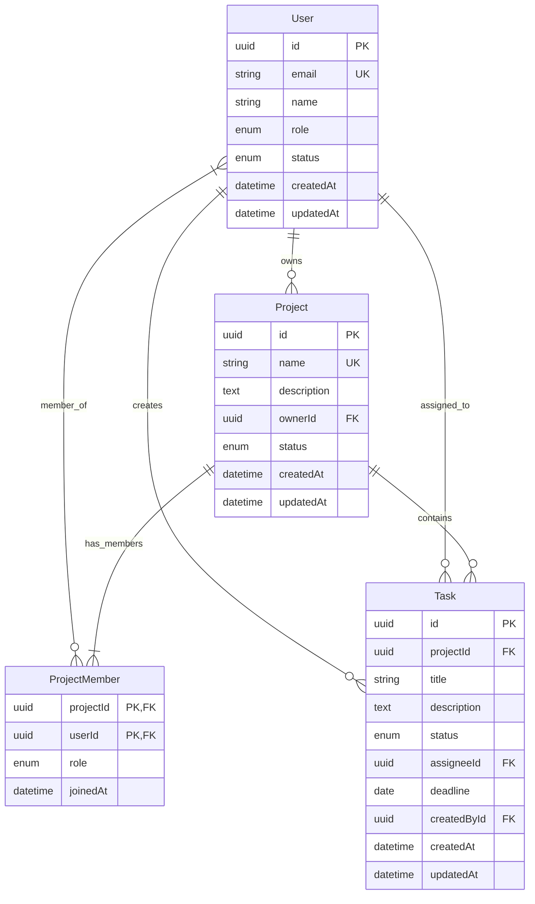

# Exemplo: TECH_SPECS.md — TaskFlow

> **Carregue com:** `@examples/EXAMPLES-TECH.MD`

---

```markdown
# Tech Specs — TaskFlow

> **Resumo executivo:** API REST em Node.js/Fastify com PostgreSQL. 
> Autenticação via JWT integrado com SSO corporativo. 
> Frontend em Next.js com shadcn/ui. Deploy em containers Docker.

## 1. Arquitetura

### Diagrama



### Componentes

| Componente | Responsabilidade | Tecnologia |
|------------|------------------|------------|
| Web App | Interface do usuário | Next.js 14 + shadcn/ui |
| API | Lógica de negócio, endpoints REST | Fastify 4 + TypeScript |
| Auth Service | Autenticação, tokens | JWT + Redis |
| Notification Service | Emails de notificação | Nodemailer |
| PostgreSQL | Persistência principal | PostgreSQL 15 |
| Redis | Cache de sessões | Redis 7 |

## 2. Modelo de Dados

### Entidade: User

```json
{
  "$schema": "http://json-schema.org/draft-07/schema#",
  "type": "object",
  "properties": {
    "id": { "type": "string", "format": "uuid" },
    "email": { 
      "type": "string", 
      "format": "email", 
      "maxLength": 255,
      "x-pii": true,
      "x-normalize": ["trim", "lowercase"]
    },
    "name": {
      "type": "string",
      "minLength": 2,
      "maxLength": 100,
      "x-pii": true,
      "x-normalize": ["trim"]
    },
    "role": {
      "type": "string",
      "enum": ["admin", "manager", "member"]
    },
    "status": {
      "type": "string",
      "enum": ["active", "inactive"]
    },
    "createdAt": { "type": "string", "format": "date-time" },
    "updatedAt": { "type": "string", "format": "date-time" }
  },
  "required": ["id", "email", "name", "role", "status"]
}
```

### Entidade: Project

```json
{
  "$schema": "http://json-schema.org/draft-07/schema#",
  "type": "object",
  "properties": {
    "id": { "type": "string", "format": "uuid" },
    "name": {
      "type": "string",
      "minLength": 3,
      "maxLength": 100,
      "x-normalize": ["trim"]
    },
    "description": {
      "type": "string",
      "maxLength": 1000
    },
    "ownerId": { "type": "string", "format": "uuid" },
    "status": {
      "type": "string",
      "enum": ["active", "archived"]
    },
    "createdAt": { "type": "string", "format": "date-time" },
    "updatedAt": { "type": "string", "format": "date-time" }
  },
  "required": ["id", "name", "ownerId", "status"]
}
```

### Entidade: Task

```json
{
  "$schema": "http://json-schema.org/draft-07/schema#",
  "type": "object",
  "properties": {
    "id": { "type": "string", "format": "uuid" },
    "projectId": { "type": "string", "format": "uuid" },
    "title": {
      "type": "string",
      "minLength": 5,
      "maxLength": 200,
      "x-normalize": ["trim"]
    },
    "description": {
      "type": "string",
      "maxLength": 5000
    },
    "status": {
      "type": "string",
      "enum": ["TODO", "IN_PROGRESS", "REVIEW", "DONE"]
    },
    "assigneeId": { 
      "type": "string", 
      "format": "uuid",
      "nullable": true
    },
    "deadline": {
      "type": "string",
      "format": "date",
      "nullable": true
    },
    "createdById": { "type": "string", "format": "uuid" },
    "createdAt": { "type": "string", "format": "date-time" },
    "updatedAt": { "type": "string", "format": "date-time" }
  },
  "required": ["id", "projectId", "title", "status", "createdById"]
}
```

### Diagrama ER



## 3. Contrato de API

### API-001: Criar Projeto

- **FEAT:** FEAT-001
- **Método:** POST
- **Path:** `/api/v1/projects`
- **Auth:** Bearer JWT (roles: admin, manager)

#### Request

```json
{
  "name": "Projeto Alpha",
  "description": "Descrição opcional do projeto",
  "memberIds": ["uuid-1", "uuid-2"]
}
```

#### Validações

| Campo | Tipo | Obrigatório | Limites | Normalização | Erro |
|-------|------|-------------|---------|--------------|------|
| name | string | sim | 3-100 chars | trim | VALIDATION.INVALID_INPUT |
| description | string | não | max 1000 | trim | VALIDATION.INVALID_INPUT |
| memberIds | uuid[] | não | max 50 items | - | VALIDATION.INVALID_INPUT |

#### Response (201 Created)

```json
{
  "data": {
    "id": "123e4567-e89b-12d3-a456-426614174000",
    "name": "Projeto Alpha",
    "description": "Descrição opcional do projeto",
    "ownerId": "owner-uuid",
    "status": "active",
    "createdAt": "2024-01-15T10:30:00.000Z",
    "updatedAt": "2024-01-15T10:30:00.000Z",
    "members": [
      { "userId": "uuid-1", "role": "member" },
      { "userId": "uuid-2", "role": "member" }
    ]
  }
}
```

#### Response (409 Conflict)

```json
{
  "code": "PROJECT.NAME_TAKEN",
  "message": "Já existe um projeto com este nome",
  "severity": "WARNING",
  "traceId": "trace-uuid"
}
```

---

### API-002: Criar Tarefa

- **FEAT:** FEAT-002
- **Método:** POST
- **Path:** `/api/v1/projects/:projectId/tasks`
- **Auth:** Bearer JWT (membro do projeto)

#### Request

```json
{
  "title": "Implementar autenticação",
  "description": "Integrar com SSO corporativo",
  "status": "TODO",
  "assigneeId": "user-uuid",
  "deadline": "2024-02-01"
}
```

#### Validações

| Campo | Tipo | Obrigatório | Limites | Normalização | Erro |
|-------|------|-------------|---------|--------------|------|
| title | string | sim | 5-200 chars | trim | VALIDATION.INVALID_INPUT |
| description | string | não | max 5000 | trim | VALIDATION.INVALID_INPUT |
| status | enum | não | TODO,IN_PROGRESS,REVIEW,DONE | - | VALIDATION.INVALID_INPUT |
| assigneeId | uuid | não | membro do projeto | - | TASK.ASSIGNEE_NOT_MEMBER |
| deadline | date | não | data futura | - | VALIDATION.INVALID_INPUT |

#### Response (201 Created)

```json
{
  "data": {
    "id": "task-uuid",
    "projectId": "project-uuid",
    "title": "Implementar autenticação",
    "description": "Integrar com SSO corporativo",
    "status": "TODO",
    "assigneeId": "user-uuid",
    "deadline": "2024-02-01",
    "createdById": "creator-uuid",
    "createdAt": "2024-01-15T10:30:00.000Z",
    "updatedAt": "2024-01-15T10:30:00.000Z"
  }
}
```

#### Response (422 Unprocessable Entity)

```json
{
  "code": "TASK.ASSIGNEE_NOT_MEMBER",
  "message": "O usuário atribuído não é membro do projeto",
  "severity": "WARNING",
  "traceId": "trace-uuid"
}
```

---

### API-003: Listar Tarefas (Kanban)

- **FEAT:** FEAT-003
- **Método:** GET
- **Path:** `/api/v1/projects/:projectId/tasks`
- **Auth:** Bearer JWT (membro do projeto)

#### Query Parameters

| Param | Tipo | Default | Descrição |
|-------|------|---------|-----------|
| view | string | list | "kanban" agrupa por status |
| assigneeId | uuid | - | Filtrar por assignee |
| status | enum | - | Filtrar por status |
| page | number | 1 | Página (se view=list) |
| perPage | number | 20 | Items por página |

#### Response (200 OK - view=kanban)

```json
{
  "data": {
    "TODO": [
      {
        "id": "task-1",
        "title": "Tarefa 1",
        "assigneeId": "user-1",
        "deadline": "2024-02-01"
      }
    ],
    "IN_PROGRESS": [
      {
        "id": "task-2",
        "title": "Tarefa 2",
        "assigneeId": "user-2",
        "deadline": "2024-01-30"
      }
    ],
    "REVIEW": [],
    "DONE": []
  },
  "meta": {
    "total": 2,
    "byStatus": {
      "TODO": 1,
      "IN_PROGRESS": 1,
      "REVIEW": 0,
      "DONE": 0
    }
  }
}
```

## 4. Integrações Externas

| Integração | Tipo | Timeout | Retries | Idempotência | Fallback |
|------------|------|---------|---------|--------------|----------|
| Corporate SSO | OAuth2 | 5s | 2 | N/A | Cache de token válido |
| SMTP (Email) | SMTP | 10s | 3 | Via messageId | Queue para retry |

## 5. Requisitos Não-Funcionais

| Requisito | Valor | Perfil | Como validar |
|-----------|-------|--------|--------------|
| Latência p95 | < 300ms | INTERNO | Load test |
| Disponibilidade | 99% (horário comercial) | INTERNO | Monitoring |
| Usuários simultâneos | 50 | INTERNO | Load test |
| Backup | Diário | INTERNO | Cron job |

## 6. Estratégia de Testes

### Cobertura por Feature

| FEAT | TEST IDs | Tipo | Cenários |
|------|----------|------|----------|
| FEAT-001 | TEST-001 a TEST-005 | unit, integration | criar projeto válido/inválido/duplicado |
| FEAT-002 | TEST-006 a TEST-010 | unit, integration | criar tarefa válida/inválida/sem permissão |
| FEAT-003 | TEST-011 a TEST-014 | integration | kanban view, filtros, permissões |

### Exemplo: TEST-001

```gherkin
# TEST-001: Criação de projeto com dados válidos
Given um usuário "admin@corp.com" autenticado com role "admin"
And não existe projeto com nome "Projeto Teste"
When POST /api/v1/projects com body { "name": "Projeto Teste" }
Then status code é 201
And response.data.name é "Projeto Teste"
And response.data.ownerId é o id do usuário admin
And o projeto existe no banco de dados
```

## 7. Matriz de Rastreabilidade Completa

| FEAT | RULE | API | TEST | ADR |
|------|------|-----|------|-----|
| FEAT-001 | RULE-001, RULE-002, RULE-003 | API-001 | TEST-001 a TEST-005 | ADR-001, ADR-002 |
| FEAT-002 | RULE-004, RULE-005, RULE-006, RULE-007 | API-002 | TEST-006 a TEST-010 | - |
| FEAT-003 | RULE-008, RULE-009 | API-003 | TEST-011 a TEST-014 | - |

## 8. Mapa de Erros Consolidado

| Code | Severity | HTTP | Quando | Exemplo Response |
|------|----------|------|--------|------------------|
| AUTH.UNAUTHORIZED | ERROR | 401 | Token ausente/expirado | `{"code":"AUTH.UNAUTHORIZED","message":"Token inválido","severity":"ERROR","traceId":"..."}` |
| AUTH.FORBIDDEN | WARNING | 403 | Sem permissão | `{"code":"AUTH.FORBIDDEN","message":"Acesso negado","severity":"WARNING","traceId":"..."}` |
| VALIDATION.INVALID_INPUT | WARNING | 400 | Dados inválidos | `{"code":"VALIDATION.INVALID_INPUT","message":"Dados inválidos","severity":"WARNING","details":[...],"traceId":"..."}` |
| PROJECT.NOT_FOUND | WARNING | 404 | Projeto não existe | `{"code":"PROJECT.NOT_FOUND","message":"Projeto não encontrado","severity":"WARNING","traceId":"..."}` |
| PROJECT.NAME_TAKEN | WARNING | 409 | Nome duplicado | `{"code":"PROJECT.NAME_TAKEN","message":"Nome já em uso","severity":"WARNING","traceId":"..."}` |
| TASK.ASSIGNEE_NOT_MEMBER | WARNING | 422 | Assignee inválido | `{"code":"TASK.ASSIGNEE_NOT_MEMBER","message":"Usuário não é membro","severity":"WARNING","traceId":"..."}` |
| INTERNAL.SERVER_ERROR | CRITICAL | 500 | Erro interno | `{"code":"INTERNAL.SERVER_ERROR","message":"Erro interno","severity":"CRITICAL","traceId":"..."}` |
```
