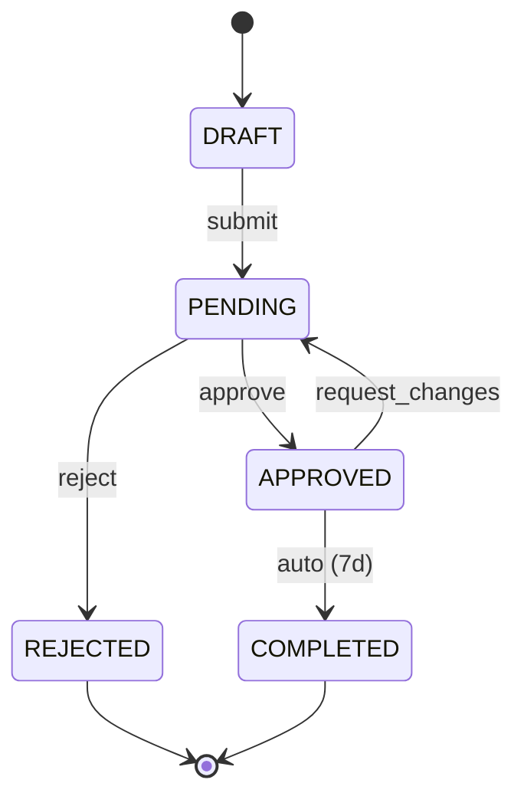

# AGENT-DOC — Regras de Autenticação e Estado

> **Quando usar:** FASE 1-3 quando o sistema tem autenticação, usuários ou campos de status.
> **Carregue com:** `@rules/RULES-AUTH.MD`
> **Escopo:** Gestão de usuários, recuperação de acesso, transições de estado.

---

## 2.7 Gestão de Usuários — Bootstrap (obrigatório se houver autenticação)

Se o sistema possui **autenticação e papéis (Roles)**, DEVE definir explicitamente:

### Opções de bootstrap (escolher pelo menos uma)

| Método | Quando usar | O que documentar |
|--------|-------------|------------------|
| **CRUD de usuários** | Admin cria usuários | Endpoints completos (API-xxx) |
| **Seed script** | Primeiro usuário via código | Comando, dados default, quando rodar |
| **CLI** | Usuários via terminal | Comandos, flags, exemplos |
| **Convite** | Self-signup controlado | Fluxo de convite, expiração, limites |
| **OAuth/SSO externo** | Auth delegada | Provider, mapeamento de roles, fallback |

### Template obrigatório

```markdown
## Gestão de Usuários

### Bootstrap (primeiro acesso)
- **Método:** [CRUD | Seed | CLI | Convite | OAuth]
- **Comando/Endpoint:** `[especificar]`
- **Dados iniciais:** `[email, senha default, role]`
- **Pós-bootstrap:** [trocar senha obrigatório? | desativar seed?]

### CRUD de usuários (se aplicável)
- [ ] Criar usuário (API-xxx)
- [ ] Listar usuários (API-xxx)
- [ ] Editar usuário (API-xxx)
- [ ] Desativar/deletar usuário (API-xxx)
- [ ] Atribuir roles (API-xxx)
```

**Anti-pattern:** Documentar auth + roles sem explicar como criar o primeiro admin.

---

## 2.9 Transições de Estado — State Machine (obrigatório para campos enum de status)

Para campos de **status (enum)**, DEVE definir explicitamente:

### Perguntas obrigatórias

1. As transições são **livres** (qualquer → qualquer) ou **restritas** (máquina de estados)?
2. **Quem** pode fazer cada transição? (roles/permissões)
3. Existe **transição automática**? (ex: timeout, evento externo)
4. É possível **reverter**? (ex: APPROVED → PENDING)

### Template obrigatório (se transições restritas)

```markdown
### State Machine: `[nome_do_campo]`

#### Estados possíveis
| Estado | Descrição | Terminal? |
|--------|-----------|-----------|
| DRAFT | Rascunho inicial | Não |
| PENDING | Aguardando aprovação | Não |
| APPROVED | Aprovado | Não |
| REJECTED | Rejeitado | Sim |
| COMPLETED | Finalizado | Sim |

#### Transições permitidas
| De | Para | Quem pode | Automática? | Reversível? |
|----|------|-----------|-------------|-------------|
| DRAFT | PENDING | owner | Não | Sim |
| PENDING | APPROVED | admin, manager | Não | Sim |
| PENDING | REJECTED | admin, manager | Não | Não |
| APPROVED | COMPLETED | system | Sim (após 7d) | Não |

#### Diagrama (Mermaid)

```

**Anti-pattern:** Definir enum `status: PENDING | APPROVED | COMPLETED` sem dizer se pode voltar de `APPROVED` para `PENDING`.

---

## 2.10 Recuperação de Acesso (condicional por perfil)

### Obrigatoriedade por perfil

| Perfil | Obrigatório? | Escopo |
|--------|--------------|--------|
| PESSOAL | Não | Mencionar "reset manual no banco" é suficiente |
| INTERNO | Simplificado | Admin-reset ou link por email |
| PRODUÇÃO | **Sim, completo** | Self-service + admin-reset + audit |

### Template obrigatório (INTERNO/PRODUÇÃO)

```markdown
### Recuperação de Acesso

#### Fluxos por tipo de usuário
| Tipo de usuário | Método de recuperação | SLA |
|-----------------|----------------------|-----|
| Usuário final | Self-service (email) | < 5min |
| Admin interno | Admin-reset por outro admin | < 1h |
| Super admin | Procedimento documentado offline | < 24h |

#### Self-service (se aplicável)
- **Endpoint:** `POST /auth/forgot-password` (API-xxx)
- **Token:** JWT com expiração de [15min | 1h | 24h]
- **Rate limit:** [3 tentativas/hora por email]
- **Notificação:** Email com link único
- **Validações:** Email existe? Usuário ativo? Último reset há mais de Xh?

#### Admin-reset
- **Quem pode:** [roles com permissão]
- **Audit log:** [obrigatório para PRODUÇÃO]
- **Notificação ao usuário:** [sim/não]

#### Bloqueio de conta
- **Após X tentativas falhas:** [bloquear temporário | captcha | notificar admin]
- **Desbloqueio:** [automático após Xh | apenas admin]
```

**Anti-pattern (PRODUÇÃO):** Sistema com múltiplos roles sem definir como cada tipo de usuário recupera acesso.

---

## Arquivos relacionados

- `@rules/RULES-CORE.MD` — Regras fundamentais (erros, validações, IDs)
- `@rules/RULES-API.MD` — Regras de API (paginação, versionamento, concorrência)
- `@AGENT-DOC.MD` — Fluxo principal do workflow
